## Review

Let's review some *univariate* concepts and code using our class survey data. If the answers aren't at the top of your mind, don't fret! We've barely started speaking this new language, and learned a ton of vocab last week, so you naturally won't remember it all.


::: {.cell}

```{.r .cell-code}
# Import data
survey <- read.csv("https://hash-mac.github.io/stat112site-s25/data/survey.csv")

# How many students have now filled out the survey?
nrow(survey)
```

::: {.cell-output .cell-output-stdout}

```
[1] 49
```


:::

```{.r .cell-code}
# What type of variables do we have?
head(survey, 1)
```

::: {.cell-output .cell-output-stdout}

```
         cafe_mac minutes_to_campus fav_temp_c       hangout
1 mashed potatoes                 5         26 the mountains
```


:::
:::


### EXAMPLE 1: Hangout Preferences {-}

Students were asked, in that moment, where they'd most like to spend time outside. How did they answer? Was there a lot of agreement or a lot of variability in answers? Build and interpret a plot that helps address these questions while reviewing:

-   "code as communication"
-   connecting with the components of a plot:
    -   set up a **frame**
    -   add a **layer** / geometric element
    -   change the **theme**, e.g. axis labels, color, fill


::: {.cell}

```{.r .cell-code}
# Attach a package needed to use the ggplot function
library("tidyverse")
```

::: {.cell-output .cell-output-stderr}

```
── Attaching core tidyverse packages ──────────────────────── tidyverse 2.0.0 ──
✔ dplyr     1.1.4     ✔ readr     2.1.5
✔ forcats   1.0.0     ✔ stringr   1.5.1
✔ ggplot2   3.5.1     ✔ tibble    3.2.1
✔ lubridate 1.9.3     ✔ tidyr     1.3.1
✔ purrr     1.0.2     
── Conflicts ────────────────────────────────────────── tidyverse_conflicts() ──
✖ dplyr::filter() masks stats::filter()
✖ dplyr::lag()    masks stats::lag()
ℹ Use the conflicted package (<http://conflicted.r-lib.org/>) to force all conflicts to become errors
```


:::

```{.r .cell-code}
# Make a ggplot
ggplot(survey, aes(x = hangout)) +
  geom_bar(fill = 'red') +
  theme_classic()
```

::: {.cell-output-display}
{width=672}
:::
:::

::: {.cell}

:::


### EXAMPLE 2: Temperature Preferences {-}

Students were asked about their ideal outdoor temperature, in degrees Celsius. How did they answer? What was the typical response? What was the range in responses? Were there any outliers? Build and interpret 2 plots that help address these questions.


::: {.cell}

```{.r .cell-code}
ggplot(survey, aes(x = fav_temp_c)) +
  geom_histogram()
```

::: {.cell-output .cell-output-stderr}

```
`stat_bin()` using `bins = 30`. Pick better value with `binwidth`.
```


:::

::: {.cell-output-display}
{width=672}
:::

```{.r .cell-code}
ggplot(survey, aes(x = fav_temp_c)) +
  geom_density()
```

::: {.cell-output-display}
{width=672}
:::
:::


::: {.callout-note title="Bar Charts vs. Histograms"}
Bar charts & histograms can appear pretty similar, but they do different things.

-   **Bar charts** count up the number of observations of each outcome of a variable. They're good for *categorical* variables, or *quantitative* variables with only a handful of possible outcomes.
-   **Histograms** count up the number of observations that fall into different numerical *ranges* of variable. They're good for *quantitative* variables, especially those with many different observed outcomes.
:::


## New stuff

Thus far, we've been studying one variable at a time, using *univariate* plots. But once we get a sense of how individual variables behave on their own, our questions often turn to *relationships* among variables. For example, in our `hikes` data:

-   How much `time` does it take to complete a hike? ------\> How is `time` related to a hike's `elevation`? What about its `length`?
-   How does difficult `rating` vary from hike to hike? -------\> How is difficulty `rating` related to a hike's `ascent`?


### Exploring relationships

Exploring univariate patterns often sparks follow-up questions about **relationships** between 2+ variables. Often, but not always, variables take on specific roles:

-   **response variable**: the variable whose variability we would like to explain (`time` to complete a hike)
-   **predictors**: variables that might explain some of the variability in the response (a hike's `elevation` or `length`)

Visualizations can help explore:

-   relationship *trends* (direction and form)
-   relationship *strength* (degree of variability from the trend)
-   *outliers* in the relationship

#### EXAMPLE 3 {-}

For each pair of variables below, sketch on paper a visualization of their relationship. Focus on general viz process, don't worry about the exact details. The data here are totally made up.

  a.  3pm temperature (response) vs 9am temperature (predictor)


::: {.cell}

```{.r .cell-code}
data.frame(temp_3pm = c(24, 26, 20, 15, 15, 15), temp_9am = c(14, 18, 15, 13, 11, 11))
```

::: {.cell-output .cell-output-stdout}

```
  temp_3pm temp_9am
1       24       14
2       26       18
3       20       15
4       15       13
5       15       11
6       15       11
```


:::
:::


  b.  3pm temperature (response) vs location (predictor)


::: {.cell}

```{.r .cell-code}
weather <- data.frame(temp_3pm = c(24, 26, 20, 15, 15, 0, 40, 60, 57, 44, 51, 75),
                      location = rep(c("A", "B"), each = 6))
weather
```

::: {.cell-output .cell-output-stdout}

```
   temp_3pm location
1        24        A
2        26        A
3        20        A
4        15        A
5        15        A
6         0        A
7        40        B
8        60        B
9        57        B
10       44        B
11       51        B
12       75        B
```


:::
:::


Think: How might we modify the below density plot of `temp_3pm` to distinguish between locations?


::: {.cell}

```{.r .cell-code}
ggplot(weather, aes(x = temp_3pm)) +
      geom_density()
```

::: {.cell-output-display}
{width=672}
:::
:::


c.  `rain_today` (the response) and `location` (the predictor)


::: {.cell}

```{.r .cell-code}
weather <- data.frame(rain_today = c("no", "no", "no", "no", "yes", "no", "yes", "no", "yes", "yes", "no", "yes"),
                        location = c(rep("A", 7), rep("B", 5)))
    weather
```

::: {.cell-output .cell-output-stdout}

```
   rain_today location
1          no        A
2          no        A
3          no        A
4          no        A
5         yes        A
6          no        A
7         yes        A
8          no        B
9         yes        B
10        yes        B
11         no        B
12        yes        B
```


:::
:::


Think: How might we modify the below bar plot of `location` to distinguish between days on which it did or didn't rain?


::: {.cell}

```{.r .cell-code}
ggplot(weather, aes(x = location)) +
      geom_bar()
```

::: {.cell-output-display}
{width=672}
:::
:::


### General guidance for building bivariate plots

As with univariate plots, an appropriate visualization for the relationship between 2 variables depends upon whether the variables are **quantitative** or **categorical**. In general:

-   Each **quantitative variable** requires a new *axis* (or a quantitative *scale* if we run out of axes).
-   Each **categorical variable** requires a new way to "group" the graphic (eg: using colors, shapes, separate facets, etc)
-   For visualizations in which **overlap** in glyphs or plots obscures the patterns, try faceting or transparency.


## Exercises (required)

[Github user Tony McGovern](https://github.com/tonmcg/US_County_Level_Election_Results_08-20) has compiled and made available 2020/2016/2012 presidential election results for most of 3000+ U.S. counties, except Alaska. (Image: [Wikimedia Commons](https://commons.wikimedia.org/wiki/File:Map_of_USA_with_county_outlines_(black_%26_white).png))


A wrangled version of this data, is imported below, after being combined with:

-   2013 county-level demographics from the `df_county_demographics` data set from the `choroplethr` R package
-   historical voting trends in the state in which the county falls (from <https://www.270towin.com/content/blue-and-red-states>):
    - red = consistently Republican
    - blue = consistently Democratic
    - purple = something in between


::: {.cell}

```{.r .cell-code}
# Load data
elections <- read.csv("https://mac-stat.github.io/data/election_2020_county.csv")

# Check it out
head(elections)
```

::: {.cell-output .cell-output-stdout}

```
  state_name state_abbr historical    county_name county_fips total_votes_20
1    Alabama         AL        red Autauga County        1001          27770
2    Alabama         AL        red Baldwin County        1003         109679
3    Alabama         AL        red Barbour County        1005          10518
4    Alabama         AL        red    Bibb County        1007           9595
5    Alabama         AL        red  Blount County        1009          27588
6    Alabama         AL        red Bullock County        1011           4613
  repub_pct_20 dem_pct_20 winner_20 total_votes_16 repub_pct_16 dem_pct_16
1        71.44      27.02     repub          24661        73.44      23.96
2        76.17      22.41     repub          94090        77.35      19.57
3        53.45      45.79     repub          10390        52.27      46.66
4        78.43      20.70     repub           8748        76.97      21.42
5        89.57       9.57     repub          25384        89.85       8.47
6        24.84      74.70       dem           4701        24.23      75.09
  winner_16 total_votes_12 repub_pct_12 dem_pct_12 winner_12 total_population
1     repub          23909        72.63      26.58     repub            54907
2     repub          84988        77.39      21.57     repub           187114
3     repub          11459        48.34      51.25       dem            27321
4     repub           8391        73.07      26.22     repub            22754
5     repub          23980        86.49      12.35     repub            57623
6       dem           5318        23.51      76.31       dem            10746
  percent_white percent_black percent_asian percent_hispanic per_capita_income
1            76            18             1                2             24571
2            83             9             1                4             26766
3            46            46             0                5             16829
4            75            22             0                2             17427
5            88             1             0                8             20730
6            22            71             0                6             18628
  median_rent median_age
1         668       37.5
2         693       41.5
3         382       38.3
4         351       39.4
5         403       39.6
6         276       39.6
```


:::
:::


We'll use this data to explore voting outcomes within the U.S.'s 2-party system. Here's a list of candidates by year:

| year | Republican candidate | Democratic candidate |
|:-----|:---------------------|:---------------------|
| 2020 | Donald Trump         | Joe Biden            |
| 2016 | Donald Trump         | Hillary Clinton      |
| 2012 | Mitt Romney          | Barack Obama         |


### Exercise 0: Review {.unnumbered}

#### Part a {.unnumbered}

How many, or roughly what percent, of the 3000+ counties did the Republican candidate win in 2020?

-   Take a guess.
-   Then make a plot of the `winner` variable.
-   Then discuss what follow-up questions you might have (and that our data might help us answer).


::: {.cell}

:::


#### Part b {.unnumbered}

The `repub_pct_20` variable provides more detail about the Republican support in each county. Construct a plot of `repub_pct_20`.

Notice that the distribution of Republican support from county to county is slightly **left skewed** or **negatively skewed**.

What follow-up questions do you have?


::: {.cell}

:::


### Exercise 1: Quantitative vs Quantitative Intuition Check {.unnumbered}

::: {.callout-important title="Be Quick"}

Don't spend more than 3 minutes on this! 

:::

Below is a **scatterplot** of the Republican support in 2020 vs 2016. Notice that:

-   both variables are quantitative, and get their own axes
-   the *response* variable is on the y-axis, demonstrating how `repub_pct_20` might be predicted by `repub_pct_16`, not vice versa

Try to replicate this using `ggplot()`. THINK:

-   What info do you need to set up the canvas?
-   What geometric layer (`geom_???`) might add these dots / points for each county? We haven't learned this yet, just take some guesses.

{width="50%"}


::: {.cell}

:::


### Exercise 2: 2 Quantitiative Variables {.unnumbered}

Run each chunk below to build up a a scatterplot of `repub_pct_20` vs `repub_pct_16` with different *glyphs* representing each county. Address or think about any prompts in the comments (`#`).


::: {.cell}

```{.r .cell-code}
# Set up the plotting frame
# How does this differ than the frame for our histogram of repub_pct_20 alone?
ggplot(elections, aes(y = repub_pct_20, x = repub_pct_16))
```
:::

::: {.cell}

```{.r .cell-code}
# Add a layer of points for each county
# Take note of the geom!
ggplot(elections, aes(y = repub_pct_20, x = repub_pct_16)) +
  geom_point()
```
:::

::: {.cell}

```{.r .cell-code}
# Change the shape of the points
# What happens if you change the shape to another number?
ggplot(elections, aes(y = repub_pct_20, x = repub_pct_16)) +
  geom_point(shape = 3)
```
:::

::: {.cell}

```{.r .cell-code}
# YOU TRY: Modify the code to make the points "orange"
# NOTE: Try to anticipate if "color" or "fill" will be useful here. Then try both.
ggplot(elections, aes(y = repub_pct_20, x = repub_pct_16)) +
  geom_point()
```

::: {.cell-output-display}
{width=672}
:::
:::

::: {.cell}

```{.r .cell-code}
# Add a layer that represents each county by the state it's in
# Take note of the geom and the info it needs to run!
ggplot(elections, aes(y = repub_pct_20, x = repub_pct_16)) +
  geom_text(aes(label = state_abbr))
```
:::


### Exercise 3: Reflect {.unnumbered}

Summarize the relationship between the Republican support in 2020 and 2016. Be sure to comment on:

-   the strength of the relationship (weak/moderate/strong)\
-   the direction of the relationship (positive/negative)\
-   outliers (in what state do counties deviate from the national trend? Any ideas why this might be the case?)


### Exercise 4: Visualizing trend {.unnumbered}

The trend of the relationship between `repub_pct_20` and `repub_pct_16` is clearly positive and (mostly) linear. We can highlight this trend by adding a model "smooth" to the plot:


::: {.cell}

```{.r .cell-code}
ggplot(elections, aes(y = repub_pct_20, x = repub_pct_16)) +
  geom_point() +
  geom_smooth()
```
:::


#### Part a {.unnumbered}

Construct a new plot that contains the model smooth but does *not* include the individual point glyphs.


::: {.cell}

:::


#### Part b {.unnumbered}

By default, `geom_smooth()` adds a smooth, localized model line. To examine the "best" *linear model*, we can specify `method = "lm"`. It's pretty similar in this example!


::: {.cell}

```{.r .cell-code}
ggplot(elections, aes(y = repub_pct_20, x = repub_pct_16)) +
  geom_point() +
  geom_smooth(method = "lm")
```
:::


### Exercise 5: Your Turn {.unnumbered}

To examine how the 2020 results are related to some county demographics, construct scatterplots of `repub_pct_20` vs `median_rent`, and `repub_pct_20` vs `median_age`. Summarize the relationship between these two variables and comment on which is the better predictor of `repub_pct_20`, `median_rent` or `median_age`.


::: {.cell}

```{.r .cell-code}
# Scatterplot of repub_pct_20 vs median_rent


# Scatterplot of repub_pct_20 vs median_age
```
:::


### Exercise 6: A Sad Scatterplot {.unnumbered}

Next, let's explore the relationship between a county's 2020 Republican support `repub_pct_20` and the `historical` political trends in its state. In this case `repub_pct_20` is **quantitative**, but `historical` is **categorical**. Explain why a scatterplot might *not* be an effective visualization for exploring this relationship. (What questions does / doesn't it help answer?)


::: {.cell}

```{.r .cell-code}
ggplot(elections, aes(y = repub_pct_20, x = historical)) +
  geom_point()
```

::: {.cell-output-display}
{width=672}
:::
:::


### Exercise 7: Quantitative vs Categorical -- Violins & Boxes {.unnumbered}

Though the above scatterplot *did* group the counties by `historical` category, it's nearly impossible to pick out meaningful patterns in 2020 Republican support in each category. Let's try adding 2 different `geom` layers to the frame:


::: {.cell}

```{.r .cell-code}
# Side-by-side violin plots
ggplot(elections, aes(y = repub_pct_20, x = historical)) +
  geom_violin()
```
:::

::: {.cell}

```{.r .cell-code}
# Side-by-side boxplots (defined below)
ggplot(elections, aes(y = repub_pct_20, x = historical)) +
  geom_boxplot()
```
:::


Box plots are constructed from five numbers - the minimum, 25th percentile, median, 75th percentile, and maximum value of a quantitative variable:

{width="50%"}

**REFLECT:**

Summarize what you've learned about the 2020 Republican county-level support within and between red/purple/blue states.


### Exercise 8: Quantitative vs Categorical -- Intuition Check {.unnumbered}

::: {.callout-important title="Be Quick"}

Don't spend more than 3 minutes on this! 

:::

We can also visualize the relationship between `repub_pct_20` and `historical` using our familiar density plots. In the plot below, notice that we simply created a separate density plot for each `historical` category. (The plot itself is "bad" but we'll fix it below.) Try to adjust the code chunk below, which starts with a density plot of `repub_pct_20` alone, to re-create this image.

{width="50%"}


::: {.cell}

```{.r .cell-code}
ggplot(elections, aes(x = repub_pct_20)) +
  geom_density()
```

::: {.cell-output-display}
{width=672}
:::
:::


### Exercise 9: Quantitative vs Categorical -- Density Plots {.unnumbered}

Work through the chunks below and address the comments therein.


::: {.cell}

```{.r .cell-code}
# Name two "bad" things about this plot
ggplot(elections, aes(x = repub_pct_20, fill = historical)) +
  geom_density()
```
:::

::: {.cell}

```{.r .cell-code}
# What does scale_fill_manual do?
ggplot(elections, aes(x = repub_pct_20, fill = historical)) +
  geom_density() +
  scale_fill_manual(values = c("blue", "purple", "red"))
```
:::

::: {.cell}

```{.r .cell-code}
# What does alpha = 0.5 do?
# Play around with different values of alpha, between 0 and 1
ggplot(elections, aes(x = repub_pct_20, fill = historical)) +
  geom_density(alpha = 0.5) +
  scale_fill_manual(values = c("blue", "purple", "red"))
```
:::

::: {.cell}

```{.r .cell-code}
# What does facet_wrap do?!
ggplot(elections, aes(x = repub_pct_20, fill = historical)) +
  geom_density() +
  scale_fill_manual(values = c("blue", "purple", "red")) +
  facet_wrap(~ historical)
```
:::

::: {.cell}

```{.r .cell-code}
# Let's try a similar grouping strategy with a histogram instead of density plot.
# Why is this terrible?
ggplot(elections, aes(x = repub_pct_20, fill = historical)) +
  geom_histogram(color = "white") +
  scale_fill_manual(values = c("blue", "purple", "red"))
```
:::


### Exercise 10 {.unnumbered}

We've now learned 3 (of many) ways to visualize the relationship between a quantitative and categorical variable: side-by-side violins, boxplots, and density plots.

-   Which do you like best?
-   What is one pro of density plots relative to boxplots?
-   What is one con of density plots relative to boxplots?


### Exercise 11: Categorical vs Categorical -- Intuition Check {.unnumbered}

Finally, let's simply explore who *won* each county in 2020 (`winner_20`) and how this breaks down by `historical` voting trends in the state. That is, let's explore the relationship between 2 categorical variables! Following the same themes as above, we can utilize grouping features such as fill/color or facets to distinguish between different categories of `winner_20` and `historical`.

::: {.callout-important title="Be Quick"}

Spend at most 5 minutes on the following intuition check. Adjust the code below to recreate the following two plots.

:::


{width="60%"}


::: {.cell}

```{.r .cell-code}
# Plot 1: adjust this to recreate the top plot
ggplot(elections, aes(x = historical)) +
  geom_bar()
```

::: {.cell-output-display}
{width=672}
:::
:::

::: {.cell}

```{.r .cell-code}
# Plot 2: adjust this to recreate the bottom plot
ggplot(elections, aes(x = winner_20)) +
  geom_bar()
```

::: {.cell-output-display}
{width=672}
:::
:::


### Exercise 12: Categorical vs Categorical {.unnumbered}

Construct the following 4 bar plot visualizations.


::: {.cell}

```{.r .cell-code}
# A stacked bar plot
# How are the "historical" and "winner_20" variables mapped to the plot, i.e. what roles do they play?
ggplot(elections, aes(x = historical, fill = winner_20)) +
  geom_bar()
```
:::

::: {.cell}

```{.r .cell-code}
# A faceted bar plot
ggplot(elections, aes(x = winner_20)) +
  geom_bar() +
  facet_wrap(~ historical)
```
:::

::: {.cell}

```{.r .cell-code}
# A side-by-side bar plot
# Note the new argument to geom_bar
ggplot(elections, aes(x = historical, fill = winner_20)) +
  geom_bar(position = "dodge")
```
:::

::: {.cell}

```{.r .cell-code}
# A proportional bar plot
# Note the new argument to geom_bar
ggplot(elections, aes(x = historical, fill = winner_20)) +
  geom_bar(position = "fill")
```
:::


#### Part a {.unnumbered}

Name one pro and one con of using the "proportional bar plot" instead of one of the other three options.

#### Part b {.unnumbered}

What's your favorite bar plot from part and why?


### Exercise 13: Practice (now or later) {.unnumbered}

::: {.callout-important title="Decide"}

Decide what's best for you:

-   Try this extra practice now.
-   Reflect on the above exercises and come back to this extra practice later (but before the next class).

:::

Import some daily weather data from a few locations in Australia:


::: {.cell}

```{.r .cell-code}
weather <- read.csv("https://mac-stat.github.io/data/weather_3_locations.csv")
```
:::


Construct plots that address the research questions in each chunk. You might make multiple plots--there are many ways to do things!. However, don't just throw spaghetti at the wall.

Reflect before doing anything. What types of variables are these? How might you plot just 1 of the variables, and then tweak the plot to incorporate the other?


::: {.cell}

```{.r .cell-code}
# How do 3pm temperatures (temp3pm) differ by location?
```
:::

::: {.cell}

```{.r .cell-code}
# How might we predict the 3pm temperature (temp3pm) by the 9am temperature (temp9am)?
```
:::

::: {.cell}

```{.r .cell-code}
# How do the number of rainy days (raintoday) differ by location?
```
:::


## Exercises (optional)

The above visualizations are foundational and important. But they're not the only way to visualize the variables in our dataset.

### Optional Exercise 1: Many Categories {.unnumbered}

Suppose we wanted to better understand how the 2020 Republican support varied from county to county within each **state**. Since `repub_pct_20` is quantitative and `state_abbr` is categorical, we *could* make a density plot of `repub_pct_20` for each state. Reflect on why this is bad.


::: {.cell}

```{.r .cell-code}
ggplot(elections, aes(x = repub_pct_20, fill = state_abbr)) + 
  geom_density(alpha = 0.5)
```

::: {.cell-output .cell-output-stderr}

```
Warning: Groups with fewer than two data points have been dropped.
```


:::

::: {.cell-output .cell-output-stderr}

```
Warning in max(ids, na.rm = TRUE): no non-missing arguments to max; returning
-Inf
```


:::

::: {.cell-output-display}
{width=672}
:::
:::


A facet wrap would also be bad!


::: {.cell}

```{.r .cell-code}
ggplot(elections, aes(x = repub_pct_20)) + 
  geom_density(alpha = 0.5) + 
  facet_wrap(~ state_abbr)
```

::: {.cell-output .cell-output-stderr}

```
Warning: Groups with fewer than two data points have been dropped.
```


:::

::: {.cell-output .cell-output-stderr}

```
Warning in max(ids, na.rm = TRUE): no non-missing arguments to max; returning
-Inf
```


:::

::: {.cell-output-display}
{width=768}
:::
:::


When we want to compare the distribution of some quantitative outcome among *many* groups / categories, a **ridgeline plot** can be a good option. These are also called **joy plots**, named after the album cover for "Unknown Pleasures" by Joy Division. (Look it up!) To make a ridgeline plot, we can use the `geom_density_ridges()` function from the `ggridges` package.


::: {.cell}

```{.r .cell-code}
# Install ggridges package
library(ggridges)

# Make our first joy plot
# THINK: What DON'T you like about this?
ggplot(elections, aes(x = repub_pct_20, y = state_abbr)) + 
  geom_density_ridges()
```
:::

::: {.cell}

```{.r .cell-code}
# Let's put the states in order by Republican support, not alphabet
# How do you think fct_reorder works? We'll learn about this later in the semester.
ggplot(elections, aes(x = repub_pct_20, y = fct_reorder(state_abbr, repub_pct_20))) + 
  geom_density_ridges(alpha = 0.5)
```
:::

::: {.cell}

```{.r .cell-code}
# YOUR TURN: color/fill the ridges according to a state's historical voting patterns 
# and add meaningful axis labels
```
:::


**Follow-up questions**

-   Which states tend to have the most variability in outcomes from county to county? The least?
-   What other interesting patterns do you notice?
-   Does this plot prompt any other questions?


### Optional Exercise 2: Total Outcomes by State {.unnumbered}

Let's import some new data and counts up the total votes (Republican and Democratic) by state, not county. This was **wrangled** from the elections data!


::: {.cell}

```{.r .cell-code}
elections_by_state <- read.csv("https://mac-stat.github.io/data/election_2020_by_state.csv")
```
:::


For example, we might make a scatterplot of the 2020 vs 2016 outcomes:


::: {.cell}

```{.r .cell-code}
ggplot(elections_by_state, aes(y = repub_pct_20, x = repub_pct_16)) + 
  geom_point()
```

::: {.cell-output-display}
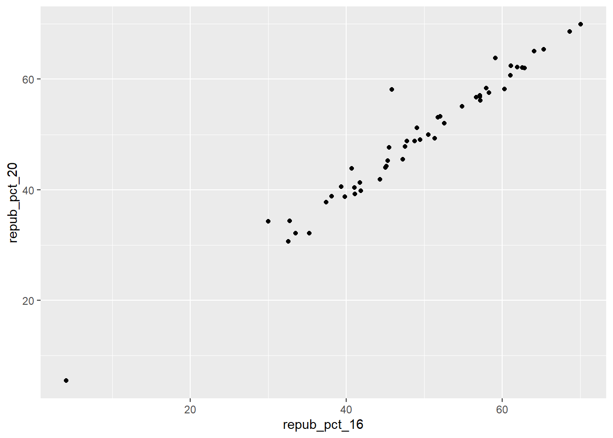{width=672}
:::
:::


BUT this isn't the easiest way to communicate or identify the changes from 1 year to the next.


::: {.cell}

```{.r .cell-code}
# YOU TRY
# Start by creating a "scatterplot" of state_abbr (y-axis) by 2020 Republican support on the x-axis
# Color the points red
# Scroll to solutions below when you're ready
```
:::

::: {.cell}

```{.r .cell-code}
# Check it out
ggplot(elections_by_state, aes(x = repub_pct_20, y = state_abbr)) + 
  geom_point(color = "red")
```

::: {.cell-output-display}
{width=768}
:::
:::

::: {.cell}

```{.r .cell-code}
# YOU TRY
# Reorder the states in terms of their 2020 Republican support (not alphabet)
# Scroll to solutions below when you're ready
```
:::

::: {.cell}

```{.r .cell-code}
# Check it out
ggplot(elections_by_state, aes(x = repub_pct_20, y = fct_reorder(state_abbr, repub_pct_20))) + 
  geom_point(color = "red")
```

::: {.cell-output-display}
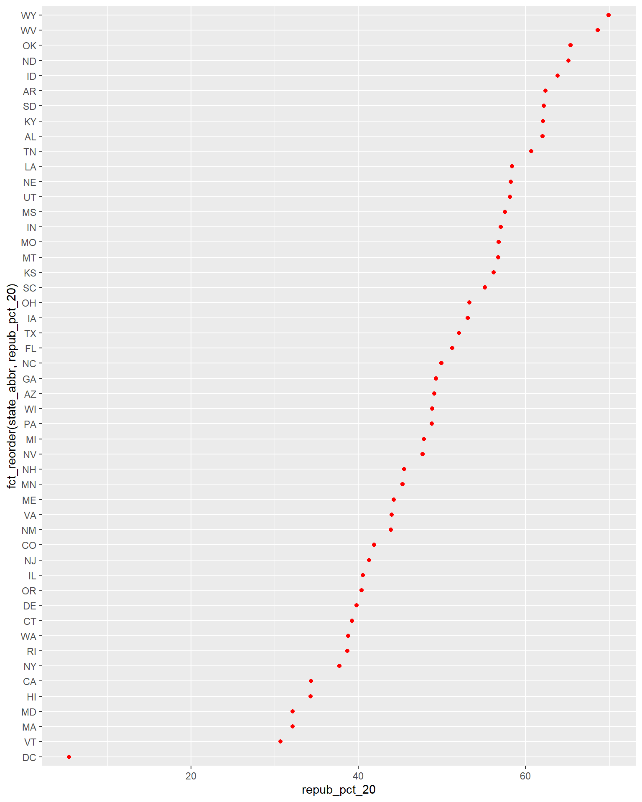{width=768}
:::
:::

::: {.cell}

```{.r .cell-code}
# Finally, add ANOTHER layer of points for the 2016 outcomes
# What info does this new geom_point() layer need to run?
ggplot(elections_by_state, aes(x = repub_pct_20, y = fct_reorder(state_abbr, repub_pct_20))) + 
  geom_point(color = "red") + 
  geom_point(aes(x = repub_pct_16, y = state_abbr))
```

::: {.cell-output-display}
{width=768}
:::
:::


**Reflect on the following**

-   What do you think this plot needs? Try it! You might need to do some digging online.
-   Summarize the main takeaways from the plots. Which states changed the most from 2016 to 2020? The least? Where did the Republican support increase? Where did it decrease?
-   What other questions are you left with?


::: content-hidden
## Wrap-up

Today's activity:

-   Knit when you're done.
-   If you're working on Mac's server, remember to download and store both the .Rmd and .html on your computer.
-   If you didn't finish in class, no problem. Finish up outside of class and check solutions in the online manual.

Homework plan:

-   The data viz unit will have 2 homeworks.\
    Homework 2 will largely be drill / practice with some guiding prompts. Homework 3 will be provide more experience working in open-ended settings.
-   Homework 2 is due in 9 days, but you should chip away at it slowly so that you have time to absorb and ask questions. It's not designed to finish in 1 sitting.

MSCS listserv:

If you’re an MSCS major / minor, or plan to be, I strongly encourage you to sign up for the [MSCS community listserv](https://docs.google.com/document/d/1Z2Ex-_z_8vm2ZhgdT4le-DwieUCtYZM8dDysaj6bseI/edit). This is where we share information about department events, internships opportunities, etc.

:::

## Solutions

<details>

<summary>Click for Solutions</summary>


::: {.cell}

```{.r .cell-code}
# Import data
survey <- read.csv("https://ajohns24.github.io/data/112/about_us_2024.csv")

# How many students have now filled out the survey?
nrow(survey)
```

::: {.cell-output .cell-output-stdout}

```
[1] 28
```


:::

```{.r .cell-code}
# What type of variables do we have?
str(survey)
```

::: {.cell-output .cell-output-stdout}

```
'data.frame':	28 obs. of  4 variables:
 $ cafe_mac         : chr  "Cheesecake" "Cheese pizza" "udon noodles" "egg rolls" ...
 $ minutes_to_campus: int  15 10 4 7 5 35 5 15 7 20 ...
 $ fave_temp        : num  18 24 18 10 18 7 75 24 13 16 ...
 $ hangout          : chr  "the mountains" "a beach" "the mountains" "a beach" ...
```


:::
:::


**EXAMPLE 1: Hangout preferences**


::: {.cell}

```{.r .cell-code}
# Attach a package needed to use the ggplot function
library(tidyverse)

# Make a ggplot
ggplot(survey, aes(x = hangout)) + 
  geom_bar()
```

::: {.cell-output-display}
{width=672}
:::
:::


**EXAMPLE 2: Temperature preferences**


::: {.cell}

```{.r .cell-code}
ggplot(survey, aes(x = fave_temp)) + 
  geom_histogram(color = "white", binwidth = 5)
```

::: {.cell-output-display}
{width=672}
:::

```{.r .cell-code}
ggplot(survey, aes(x = fave_temp)) + 
  geom_density()
```

::: {.cell-output-display}
{width=672}
:::
:::


### Exercise 0:


::: {.cell}

```{.r .cell-code}
ggplot(elections, aes(x = winner_20)) + 
  geom_bar()
```

::: {.cell-output-display}
{width=672}
:::

```{.r .cell-code}
ggplot(elections, aes(x = repub_pct_20)) + 
  geom_histogram(color = "white")
```

::: {.cell-output .cell-output-stderr}

```
`stat_bin()` using `bins = 30`. Pick better value with `binwidth`.
```


:::

::: {.cell-output-display}
{width=672}
:::

```{.r .cell-code}
ggplot(elections, aes(x = repub_pct_20)) + 
  geom_density()
```

::: {.cell-output-display}
{width=672}
:::
:::


### Exercise 1: quantitative vs quantitative intuition check {.unnumbered}

See next exercise.


### Exercise 2: 2 quantitiative variables {.unnumbered}


::: {.cell}

```{.r .cell-code}
# Set up the plotting frame
# How does this differ than the frame for our histogram of repub_pct_20 alone?
# ANSWER: we added a y-axis variable
ggplot(elections, aes(y = repub_pct_20, x = repub_pct_16))
```

::: {.cell-output-display}
{width=672}
:::

```{.r .cell-code}
# Add a layer of points for each county
# Take note of the geom: geom_point
ggplot(elections, aes(y = repub_pct_20, x = repub_pct_16)) +
  geom_point()
```

::: {.cell-output-display}
{width=672}
:::

```{.r .cell-code}
# Change the shape of the points
# What happens if you change the shape to another number?
ggplot(elections, aes(y = repub_pct_20, x = repub_pct_16)) +
  geom_point(shape = 3)
```

::: {.cell-output-display}
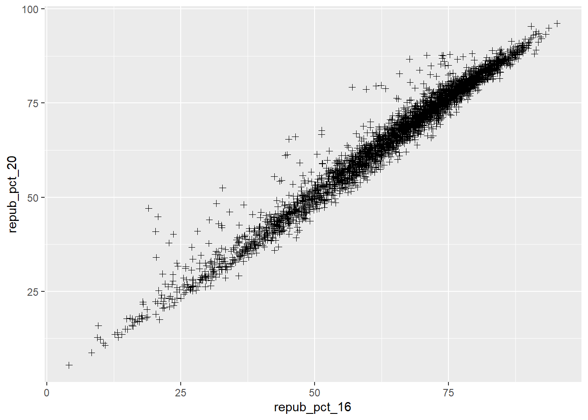{width=672}
:::

```{.r .cell-code}
# YOU TRY: Modify the code to make the points "orange"
# NOTE: Try to anticipate if "color" or "fill" will be useful here. Then try both.
ggplot(elections, aes(y = repub_pct_20, x = repub_pct_16)) +
  geom_point(color = "orange")
```

::: {.cell-output-display}
{width=672}
:::

```{.r .cell-code}
# Add a layer that represents each county by the state it's in
# Take note of the geom and the info it needs to run!
ggplot(elections, aes(y = repub_pct_20, x = repub_pct_16)) +
  geom_text(aes(label = state_abbr))
```

::: {.cell-output-display}
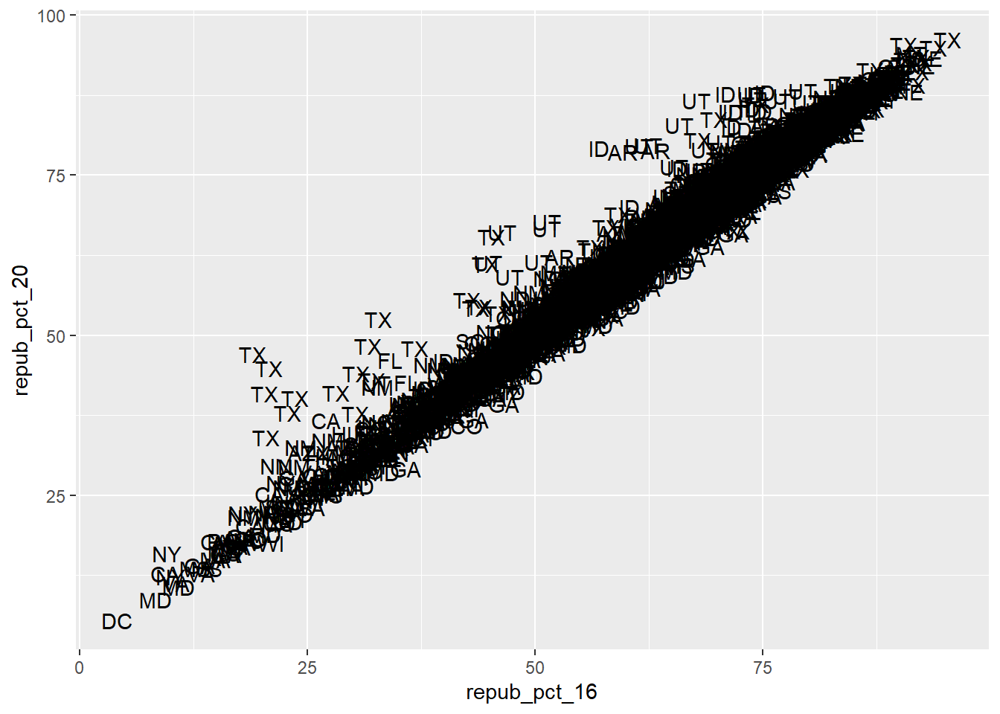{width=672}
:::
:::


### Exercise 3: Reflect {.unnumbered}

There's a strong, positive association -- the higher the Republican support in 2016, the higher it was in 2020. There are some counties in Texas and Utah where the R support in 2020 was disproportionately higher than in 2016.


### Exercise 4: Visualizing trend {.unnumbered}


::: {.cell}

```{.r .cell-code}
ggplot(elections, aes(y = repub_pct_20, x = repub_pct_16)) +
  geom_point() +
  geom_smooth()
```

::: {.cell-output .cell-output-stderr}

```
`geom_smooth()` using method = 'gam' and formula = 'y ~ s(x, bs = "cs")'
```


:::

::: {.cell-output-display}
{width=672}
:::
:::


#### Part a {.unnumbered}


::: {.cell}

```{.r .cell-code}
ggplot(elections, aes(y = repub_pct_20, x = repub_pct_16)) +
  geom_smooth()
```

::: {.cell-output .cell-output-stderr}

```
`geom_smooth()` using method = 'gam' and formula = 'y ~ s(x, bs = "cs")'
```


:::

::: {.cell-output-display}
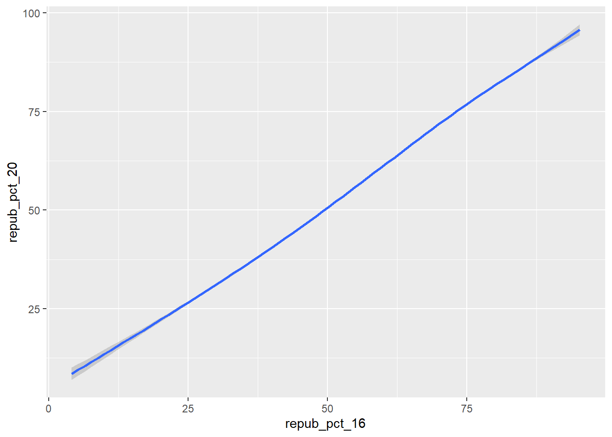{width=672}
:::
:::


#### Part b {.unnumbered}


::: {.cell}

```{.r .cell-code}
ggplot(elections, aes(y = repub_pct_20, x = repub_pct_16)) +
  geom_point() +
  geom_smooth(method = "lm")
```

::: {.cell-output .cell-output-stderr}

```
`geom_smooth()` using formula = 'y ~ x'
```


:::

::: {.cell-output-display}
{width=672}
:::
:::


### Exercise 5: Your turn {.unnumbered}

There's a moderate, positive association between R support and median age -- the older the average age in a county, the higher the R support tends to be. However, there's a stronger, *negative* association between R support and median rent -- the higher the rent (a proxy for cost of living), the lower the R support tends to be.


::: {.cell}

```{.r .cell-code}
# Scatterplot of repub_pct_20 vs median_rent
ggplot(elections, aes(y = repub_pct_20, x = median_rent)) +
  geom_point() 
```

::: {.cell-output-display}
{width=672}
:::

```{.r .cell-code}
# Scatterplot of repub_pct_20 vs median_age
ggplot(elections, aes(y = repub_pct_20, x = median_age)) +
  geom_point() 
```

::: {.cell-output-display}
{width=672}
:::
:::


### Exercise 6: A sad scatterplot {.unnumbered}

See next exercise.


### Exercise 7: quantitative vs categorical -- violins & boxes {.unnumbered}


::: {.cell}

```{.r .cell-code}
# Side-by-side violin plots
ggplot(elections, aes(y = repub_pct_20, x = historical)) +
  geom_violin()
```

::: {.cell-output-display}
{width=672}
:::

```{.r .cell-code}
# Side-by-side boxplots (defined below)
ggplot(elections, aes(y = repub_pct_20, x = historical)) +
  geom_boxplot()
```

::: {.cell-output-display}
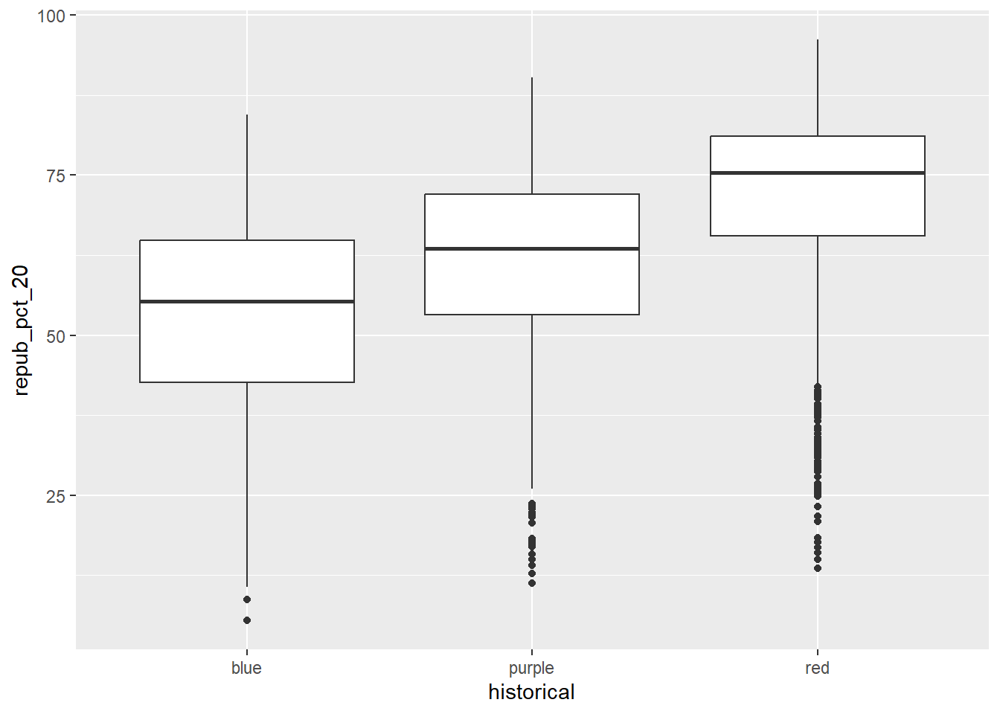{width=672}
:::
:::


**REFLECT:**

There's quite a bit of range in county-level R support within blue, purple, and red states. However, R support tends to be higher in red states and lower in blue states.


### Exercise 8: quantitative vs categorical -- intuition check {.unnumbered}

See next exercise.


### Exercise 9: quantitative vs categorical -- density plots {.unnumbered}


::: {.cell}

```{.r .cell-code}
# The colors used don't match up with the blue, purple, red labels
# The density plots are on top of each other
ggplot(elections, aes(x = repub_pct_20, fill = historical)) +
  geom_density()
```

::: {.cell-output-display}
{width=672}
:::

```{.r .cell-code}
# scale_fill_manual "hard codes" or defines what colors to use for the fill categories
ggplot(elections, aes(x = repub_pct_20, fill = historical)) +
  geom_density() +
  scale_fill_manual(values = c("blue", "purple", "red"))
```

::: {.cell-output-display}
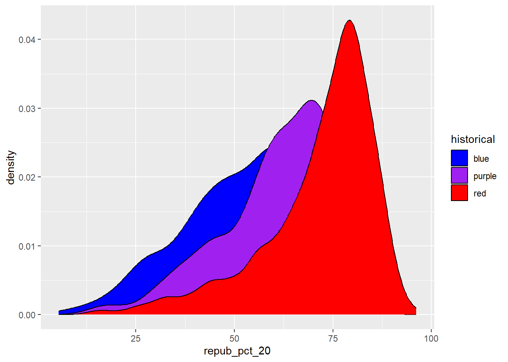{width=672}
:::

```{.r .cell-code}
# alpha = 0.5 adds transparency
# the closer alpha is to 0, the more transparent.
# the closer alpha is to 1, the more opaque.
ggplot(elections, aes(x = repub_pct_20, fill = historical)) +
  geom_density(alpha = 0.5) +
  scale_fill_manual(values = c("blue", "purple", "red"))
```

::: {.cell-output-display}
{width=672}
:::

```{.r .cell-code}
# facet_wrap separates the density plots into "facets" for each historical group
ggplot(elections, aes(x = repub_pct_20, fill = historical)) +
  geom_density() +
  scale_fill_manual(values = c("blue", "purple", "red")) +
  facet_wrap(~ historical)
```

::: {.cell-output-display}
{width=672}
:::

```{.r .cell-code}
# Let's try a similar grouping strategy with a histogram instead of density plot.
# Why is this terrible?
ggplot(elections, aes(x = repub_pct_20, fill = historical)) +
  geom_histogram(color = "white") +
  scale_fill_manual(values = c("blue", "purple", "red"))
```

::: {.cell-output .cell-output-stderr}

```
`stat_bin()` using `bins = 30`. Pick better value with `binwidth`.
```


:::

::: {.cell-output-display}
{width=672}
:::
:::


### Exercise 10 {.unnumbered}

-   One pro of density plots relative to boxplots: doesn't oversimplify the data / boil the data down to just 5 numbers.

-   Name one con of density plots relative to boxplots: boxplots can be easier to interpret


### Exercise 11: categorical vs categorical intuition check {.unnumbered}

see exercise below


### Exercise 12: categorical vs categorical {.unnumbered}


::: {.cell}

```{.r .cell-code}
# A stacked bar plot
# historical = x axis / bar categories
# winner_20 = fills the bars
ggplot(elections, aes(x = historical, fill = winner_20)) +
  geom_bar()
```

::: {.cell-output-display}
{width=672}
:::

```{.r .cell-code}
# A faceted bar plot
ggplot(elections, aes(x = winner_20)) +
  geom_bar() +
  facet_wrap(~ historical)
```

::: {.cell-output-display}
{width=672}
:::

```{.r .cell-code}
# A side-by-side bar plot
# Note the new argument to geom_bar
ggplot(elections, aes(x = historical, fill = winner_20)) +
  geom_bar(position = "dodge")
```

::: {.cell-output-display}
{width=672}
:::

```{.r .cell-code}
# A proportional bar plot
# Note the new argument to geom_bar
ggplot(elections, aes(x = historical, fill = winner_20)) +
  geom_bar(position = "fill")
```

::: {.cell-output-display}
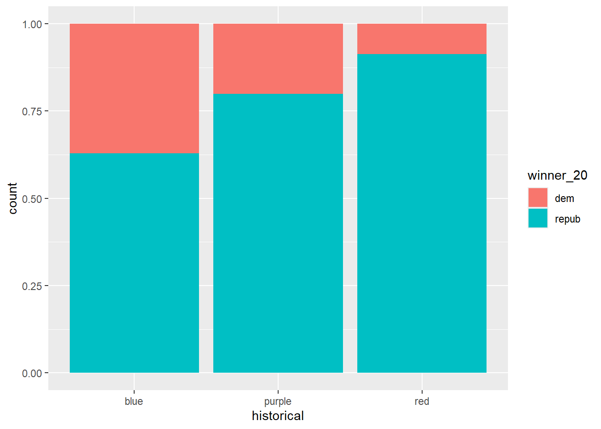{width=672}
:::
:::


#### Part a {.unnumbered}

pro = easier to compare the relative outcomes in blue vs purple vs red states con = lose track of how many counties fall into blue vs purple vs red states


### Exercise 13: Practice (now or later) {.unnumbered}


::: {.cell}

```{.r .cell-code}
weather <- read.csv("https://mac-stat.github.io/data/weather_3_locations.csv")

# How do 3pm temperatures (temp3pm) differ by location?
ggplot(weather, aes(x = temp3pm, fill = location)) + 
  geom_density(alpha = 0.5)
```

::: {.cell-output .cell-output-stderr}

```
Warning: Removed 19 rows containing non-finite outside the scale range
(`stat_density()`).
```


:::

::: {.cell-output-display}
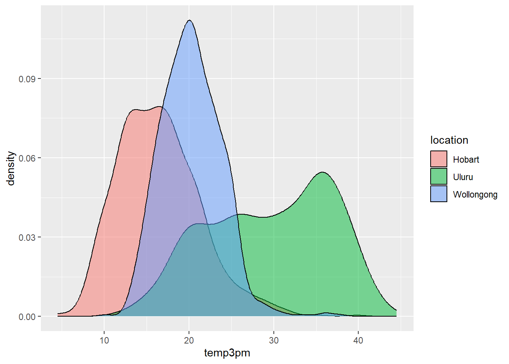{width=672}
:::

```{.r .cell-code}
ggplot(weather, aes(y = temp3pm, x = location)) + 
  geom_boxplot()
```

::: {.cell-output .cell-output-stderr}

```
Warning: Removed 19 rows containing non-finite outside the scale range
(`stat_boxplot()`).
```


:::

::: {.cell-output-display}
{width=672}
:::

```{.r .cell-code}
# How might we predict the 3pm temperature (temp3pm) by the 9am temperature (temp9am)?
ggplot(weather, aes(y = temp3pm, x = temp9am)) + 
  geom_point()
```

::: {.cell-output .cell-output-stderr}

```
Warning: Removed 27 rows containing missing values or values outside the scale range
(`geom_point()`).
```


:::

::: {.cell-output-display}
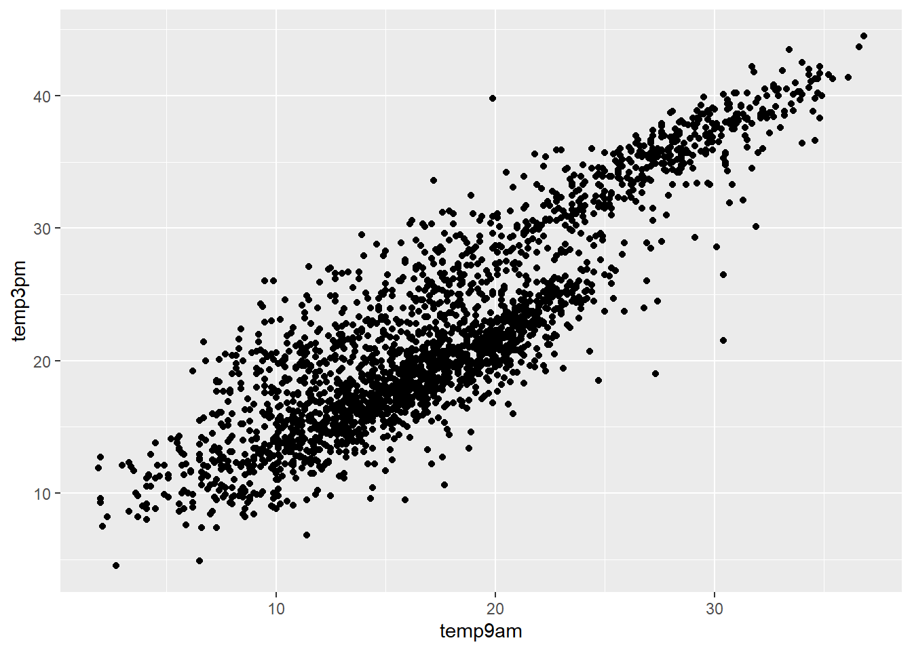{width=672}
:::

```{.r .cell-code}
# How do the number of rainy days (raintoday) differ by location?
ggplot(weather, aes(x = location, fill = raintoday)) + 
  geom_bar()
```

::: {.cell-output-display}
{width=672}
:::
:::


### Optional exercise 1: Dealing with lots of categories {.unnumbered}


::: {.cell}

```{.r .cell-code}
# Install ggridges package
library(ggridges)

# Make our first joy plot
# THINK: What DON'T you like about this?
ggplot(elections, aes(x = repub_pct_20, y = state_abbr)) + 
  geom_density_ridges()
```

::: {.cell-output .cell-output-stderr}

```
Picking joint bandwidth of 4.43
```


:::

::: {.cell-output-display}
{width=768}
:::

```{.r .cell-code}
# Let's put the states in order by Republican support, not alphabet
# How do you think fct_reorder works? We'll learn about this later in the semester.
ggplot(elections, aes(x = repub_pct_20, y = fct_reorder(state_abbr, repub_pct_20))) + 
  geom_density_ridges(alpha = 0.5)
```

::: {.cell-output .cell-output-stderr}

```
Picking joint bandwidth of 4.43
```


:::

::: {.cell-output-display}
{width=768}
:::

```{.r .cell-code}
# YOUR TURN: color/fill the ridges according to a state's historical voting patterns 
# and add meaningful axis labels
ggplot(elections, aes(x = repub_pct_20, y = fct_reorder(state_abbr, repub_pct_20), fill = historical)) + 
  geom_density_ridges(alpha = 0.5) + 
  labs(y = "state", x = "2020 Republican support (%)") + 
  scale_fill_manual(values = c("blue", "purple", "red"))
```

::: {.cell-output .cell-output-stderr}

```
Picking joint bandwidth of 4.43
```


:::

::: {.cell-output-display}
{width=768}
:::
:::


### Optional exercise 2: total outcomes by state {.unnumbered}


::: {.cell}

```{.r .cell-code}
elections_by_state <- read.csv("https://mac-stat.github.io/data/election_2020_by_state.csv")

ggplot(elections_by_state, aes(y = repub_pct_20, x = repub_pct_16)) + 
  geom_point()
```

::: {.cell-output-display}
{width=768}
:::

```{.r .cell-code}
# YOU TRY
# Start by creating a "scatterplot" of state_abbr (y-axis) by 2020 Republican support on the x-axis
# Color the points red
ggplot(elections_by_state, aes(x = repub_pct_20, y = state_abbr)) + 
  geom_point(color = "red")
```

::: {.cell-output-display}
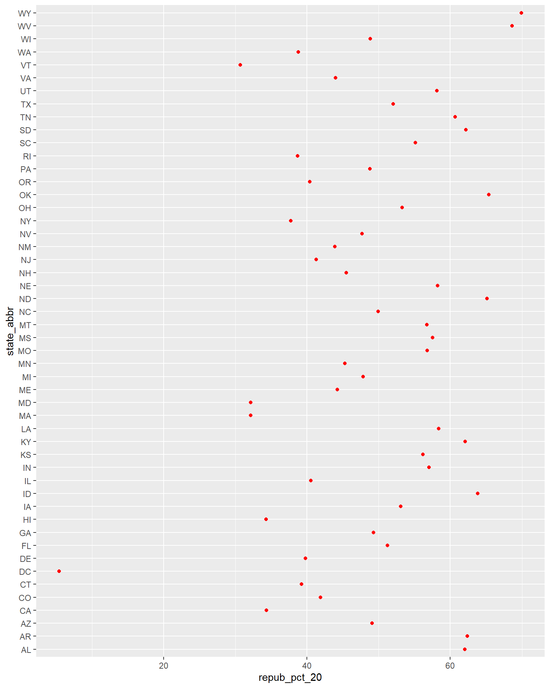{width=768}
:::

```{.r .cell-code}
# YOU TRY
# Reorder the states in terms of their 2020 Republican support (not alphabet)
ggplot(elections_by_state, aes(x = repub_pct_20, y = fct_reorder(state_abbr, repub_pct_20))) + 
  geom_point(color = "red")
```

::: {.cell-output-display}
{width=768}
:::

```{.r .cell-code}
# Finally, add ANOTHER layer of points for the 2016 outcomes
# What info does this new geom_point() layer need to run?
ggplot(elections_by_state, aes(x = repub_pct_20, y = fct_reorder(state_abbr, repub_pct_20))) + 
  geom_point(color = "red") + 
  geom_point(aes(x = repub_pct_16, y = state_abbr))
```

::: {.cell-output-display}
{width=768}
:::
:::


</details>

